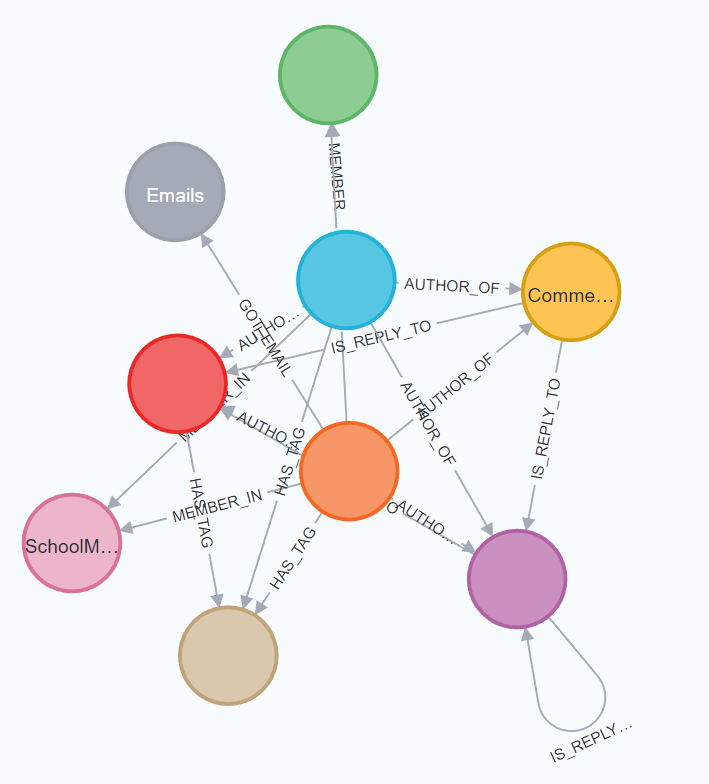
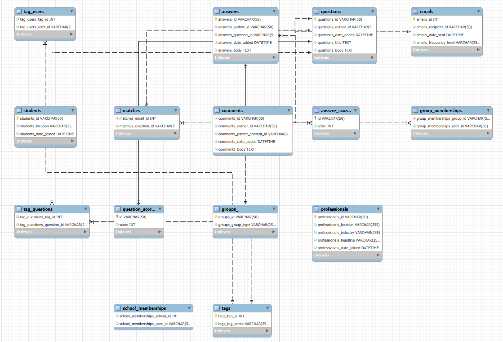

# Python client to intialise the SQL & Neo4j DBMS

The code implemented in this repository is a direct implementation of the research paper: https://www.researchgate.net/publication/220996559_A_comparison_of_a_graph_database_and_a_relational_database_A_data_provenance_perspective


## Overall prerequisites
Extract the dataset in the ./dataset directory by executing the following command in the root directory:

`unzip data-science-for-good-careervillage.zip -d dataset`

OR 

manually unzip in a folder called dataset in the root directory

## Overall code organization/ directory structure
- `neo4j-db` : contains python scripts to load data into Neo4j database
- `sql-db` : contains python scripts to load data into sql database
- `data-science-for-good-careervillage.zip` : compressed version of dataset

## Steps for Neo4j


Make sure you update the paths of the csv in the `neo4j-db/load_nodes.py` & `neo4j-db/create_relationships.py` in the bottom. I have use absolute paths as relative paths don't work in the cypher queries. 


1. Install [Neo4j Desktop](https://neo4j.com/download/)
2. Click on the 3 dots besides the big blue button, and then Settings. Paste the contents of `neo4j.conf` file.
3. Create a database named `careervillage`
4. Edit the username, password and database name in the `.env` file in the `./neo4j-db` directory.
    ```
    DB_NAME=careervillage
    DB_USER=neo4j
    DB_PASSWORD=*****
    ```
5. Start the database and click the big blue button `Open` which will route you to Neo4j Browser.
6. Run the following command in the prompt `:server user add`. Set your Username & Password=and assign the role 'Admin'.
7. Install the dependencies using `pip3 install neo4j-db/requirements.txt`
8. Run the `neo4j-db/load_nodes.py` which will create a node corresponding to each record in the CSV file.
9. Run the `neo4j-db/create_relationships.py` which will create relationships between nodes.
10. Run the following set of queries specified in the `neo4j-db/cypher_queries.txt` file and visualise the results visually on Neo4j Desktop Client. 

Post completion, a beautiful graph will emerge in the neo4j desktop client



## Steps for MySQL

### Pre-requisities to run this mysql-python-client
- Installed and running instance of MySQL server (tested on version 8.0.32)
- Python (tested on version 3.9.13)
- Python packages:
    - mysql-connector-python
    - python-dotenv
- all csv files of the dataset present in ./dataset directory

### Code organization/ Directory structure
- `sql-db/createDB.py` : python script to create the required datbase
- `sql-db/createTables.py` : python script to create the required tables
- `sql-db/createDB.py` : python script to load csv file data into tables

### Running the mysql-python-client
Steps to run this application
- Set up envornment varaibles file `.env` in the `./sql-db` directory
    ```
    DB_NAME=careervillage
    DB_USER=mysqluser
    DB_PASSWORD=*****
    ```

- Execute the following command

1. Run the `sql-db/create_db.py` which will create a database in the mysql database.
2. Run the `sql-db/create_tables.py` which will create tables in the database.
3. Run the `sql-db/load_data.py` which will load the csv files into the tables.

The complete process of loading the data has been automated and progress updates are displayed on terminal

### Result
After successfully loading the daatset into MySQL the following databse will be created



### Environment specifications
Following are the specifications of the environment on which this mysql-pyhton-client  was last executed/tested: 
- OS: Windows 11
- Memory: 16 GB
- MySQL version: Community Edition - 8.0.32
- Python version: 3.9.13